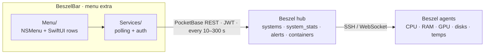

<div align="center">

# BeszelBar

**A native macOS menu bar client for [Beszel](https://github.com/henrygd/beszel) server monitoring.**
<br>
Reads your hub's REST API and renders systems, GPUs, disks and containers as glanceable menu bar rows. No browser, no vendor account, no background cloud service.

[](https://github.com/nichtlegacy/BeszelBar/actions/workflows/ci.yml)
[](https://www.apple.com/macos/)
[](project.yml)
[](Sources)
[](project.yml)
[](LICENSE)

**[Download](https://github.com/nichtlegacy/BeszelBar/releases)**

[Overview](#overview) • [Install](#install) • [Agent setup](#agent-setup) • [Settings](#settings) • [Architecture](#architecture) • [Development](#development) • [Releasing](#releasing)


</div>

## Overview

Beszel is a lightweight, self-hosted server monitoring hub — but checking it means opening a browser tab. BeszelBar puts the whole fleet in the macOS menu bar: every system as a row with live badges, and a hover panel with the numbers behind them.

The project stays deliberately:

- **menu-bar-first** — no dock icon, no window, one click to everything.
- **read-only** — BeszelBar never writes to your hub. Credentials live in the macOS Keychain, never in plain files.
- **dependency-free** — Swift, SwiftUI and AppKit. No Sparkle, no updater, no third-party packages.
- **honest about what it knows** — values come from the hub's API; whatever the hub does not report is not shown. Feature-rich data (GPU, extra disks) requires reasonably recent Beszel agents.

> Unofficial hobby project. Not affiliated with the Beszel project — see [Disclaimer](#disclaimer).

## Highlights

- **Live system rows** — status, CPU, memory, GPU and disk badges per system, refreshed every 10–300 seconds.
- **GPU monitoring** — per-GPU utilization, VRAM, temperature and power draw in the hover panel; the progress bar switches between utilization and VRAM view.
- **Multi-disk & pools** — root disk, extra filesystems and ZFS/btrfs pools with capacity and df-style GB/TB formatting. Disks sharing a name merge into one group row, so a three-disk array reads as a single "Media" entry.
- **Disk aliases** — rename or hide any disk per system in Settings; the hub only reports device names.
- **Hover details** — CPU model, cores/threads, temperature, uptime, RAM and usage bars for every metric.
- **Containers & alerts** — Docker containers with health status inside each system's submenu; triggered alerts surface at the top.
- **Multi-hub** — connect several Beszel hubs and switch between them instantly.

## Requirements

- **macOS** — 14 Sonoma or later
- **Beszel** — a running hub with a user account; agents 0.19+ recommended for full GPU/disk data
- **Build** — Xcode 16+ and [xcodegen](https://github.com/yonaskolb/XcodeGen), only when building from source

## Install

1. Download `BeszelBar-<version>.zip` from the [releases page](https://github.com/nichtlegacy/BeszelBar/releases).
2. Unzip and drag **BeszelBar** into **Applications**.
3. Launch it. The rack icon appears in the menu bar; no window opens.
4. Open **Settings → Hubs**, add your hub URL, email and password (or JWT).

Releases are signed and notarized when built with the release scripts. If a build is not, macOS blocks the first launch — clear it with:

```bash
xattr -dr com.apple.quarantine /Applications/BeszelBar.app
```

### From source

```bash
git clone https://github.com/nichtlegacy/BeszelBar.git
cd BeszelBar
./build.sh                 # xcodegen + xcodebuild, copies to build/Release
open build/Release/BeszelBar.app
```

## Agent setup

BeszelBar can only display what your agents report. The agent monitors the root filesystem by default; everything else is opt-in via environment variables:

| Env var | Effect | Example |
|---|---|---|
| `FILESYSTEM` | Root disk I/O mapping; `device__name` gives it a display name | `nvme1n1p1__Cache` |
| `EXTRA_FILESYSTEMS` | Additional filesystems to monitor (comma-separated, mount points or devices) | `/mnt/disk1,/mnt/disk2` |
| `SENSORS` | Temperature sensor filter; prefix `-` to blacklist | `-nct6798_auxtin1` |

On Unraid, mount data disks read-only under `/extra-filesystems/<name>` instead — the agent picks them up automatically. Network shares never appear unless you explicitly configure them.

## Settings

| Pane | What it controls |
|---|---|
| General | Launch at login, stats badges in the menu, systems shown, refresh interval, usage/temperature color thresholds |
| Disks | GPU progress bar metric (utilization/VRAM), per-system disk names and visibility |
| Hubs | Hub connections, stored in the Keychain |
| About | Version, links, license |

## Architecture



| Layer | Responsibility | Location |
|---|---|---|
| App | Status item, menu rebuild loop on state changes, settings window | [`Sources/App`](Sources/App) |
| Services | PocketBase client (auth, pagination, batched latest-stats), refresh timer, Keychain | [`Sources/Services`](Sources/Services) |
| Menu | Menu construction and the SwiftUI row/detail views | [`Sources/Menu`](Sources/Menu) |
| Models | Decoding of the hub's compact JSON payloads (`SystemInfo`, per-GPU and per-disk stats) | [`Sources/Models`](Sources/Models) |

## Uninstall

```bash
rm -rf /Applications/BeszelBar.app
defaults delete com.nohitdev.BeszelBar
```

## Project structure

```text
Sources/
├── App/            # status item lifecycle, state, settings UI
├── Menu/           # NSMenu builder + row/detail views
├── Models/         # Beszel JSON payload decoding
└── Services/       # hub API client, refresh timer, Keychain
scripts/            # signing/notarization and Homebrew cask release
homebrew/           # cask template
```

There is no test target yet; CI builds the app on every push to verify compilation.

## Development

```bash
xcodegen generate         # regenerate the Xcode project from project.yml
open BeszelBar.xcodeproj  # or: xcodebuild -scheme BeszelBar build
```

## Releasing

1. Bump `bundleShortVersion`/`bundleVersion` in [`project.yml`](project.yml) and regenerate.
2. Run `scripts/sign-and-notarize.sh` (requires `DEVELOPER_ID_APPLICATION` and App Store Connect API keys).
3. Upload the zip to a new GitHub release, then optionally `scripts/release-cask.sh` to update the Homebrew cask.

## Credits

BeszelBar was created by **[Loriage](https://github.com/Loriage)** ([Loriage/BeszelBar](https://github.com/Loriage/BeszelBar)). This fork carries the project forward with GPU monitoring, multi-disk display with aliases and grouping, configurable thresholds and a reworked settings UI.

- **[henrygd/beszel](https://github.com/henrygd/beszel)** — the monitoring server BeszelBar reads from. None of this exists without it.

## License

[MIT](LICENSE) — © 2026 Loriage, © 2026 nichtlegacy. Do what you like with it.

## Disclaimer

**BeszelBar is an unofficial, independent hobby project.** It is not affiliated with, endorsed by, sponsored by, or connected to the Beszel project or its authors in any way.

"Beszel" is a project name of its respective authors and is used here only to describe which software this app interoperates with.

---

<p align="center"><sub>Built by <a href="https://github.com/nichtlegacy">nichtlegacy</a></sub></p>
